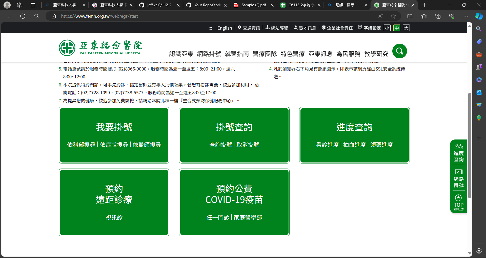
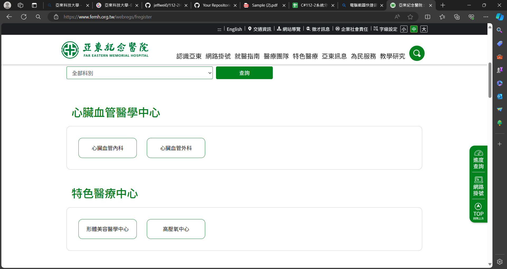
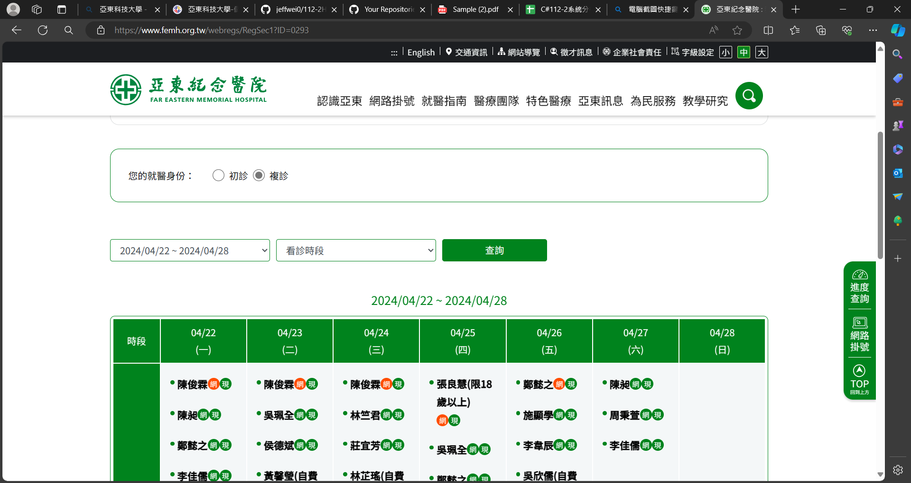
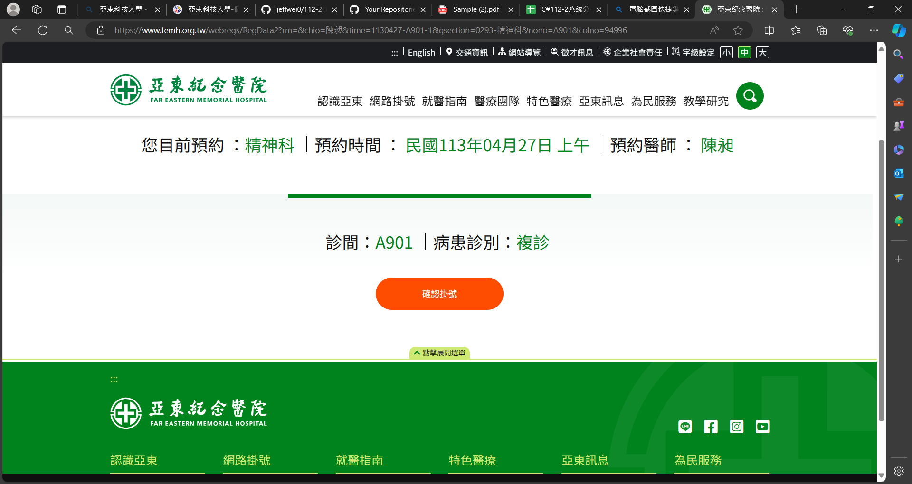
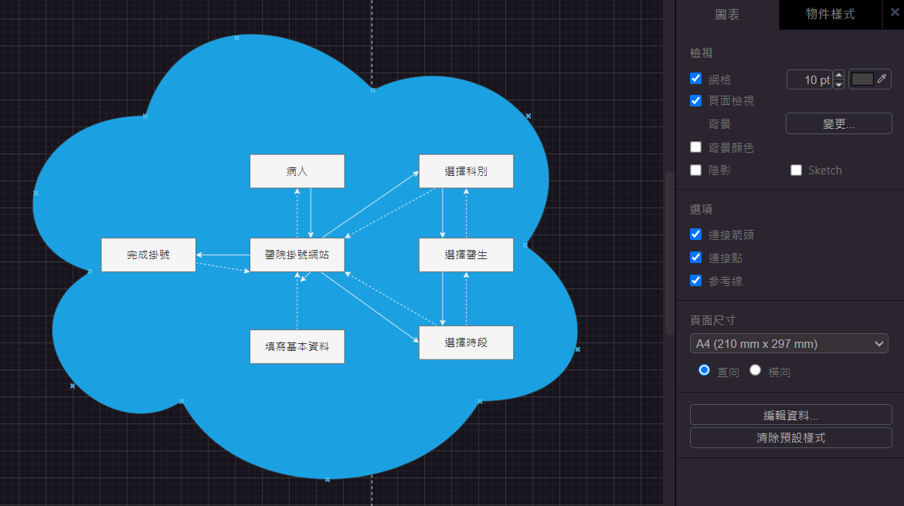
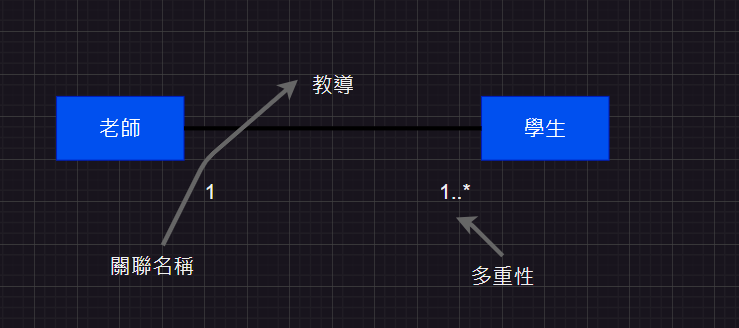

# 第2次作業-作業-HW2
>
>學號：111111211
> 
>姓名：李俊威
> 
>作業撰寫時間：180 (mins，包含程式撰寫時間)
> 
>最後撰寫文件日期：2024/04/21
>

本份文件包含以下主題：(至少需下面兩項，若是有多者可以自行新增)
- [x] 說明內容
- [x] 個人認為完成作業須具備觀念

## 說明程式與內容

1-a

物件：我要掛號、掛號查詢、進度查詢、預約遠端整療、預約公告。

物件：各科別的名稱

物件：初診、複診、選擇時間與醫師

物件：確認掛號
1-b

answer1.drawio截圖

answer2.drawio截圖

## 個人認為完成作業須具備觀念

開始寫說明，需要說明本次作業個人覺得需學會那些觀念，亦可作為學習筆記使用 (需寫成文章，需最少50字，並且文內不得有你、我、他三種文字)